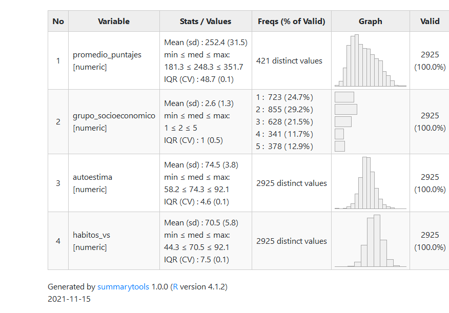
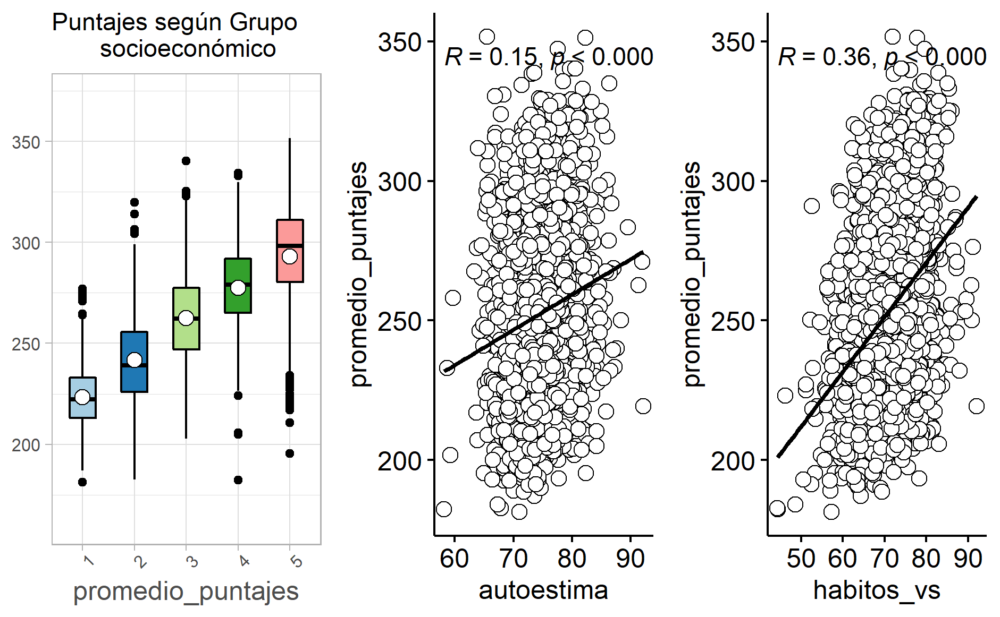

## Resumen

Para el desarrollo de políticas públicas orientadas a mejorar la calidad educativa en Chile, se utilizan herramientas encargadas de medir aspectos como el rendimiento académico de los establecimientos educacionales a lo largo del país. Diversas investigaciones han demostrado la variedad de factores que inciden, ya sea negativa o positivamente, en los resultados obtenidos por los alumnos. Esta investigación tiene como objetivo determinar el efecto que las variables de: Autoestima académica y motivación escolar; Hábitos saludables y; Grupo Socioeconómico al que pertenece el establecimiento, tienen sobre el rendimiento académico. 

Para ello, se utilizó la base de datos SIMCE de segundo año de enseñanza media, edición 2018, la cual cuenta con 2925 casos -luego de filtrar casos perdidos- y 76 variables, de las cuales se seleccionó una variable dependiente: promedio de puntajes respecto de la media alcanzada por establecimiento para cada prueba, y 3 independientes: Puntaje de Autoestima académica, Puntaje de Hábitos de vida saludable y Nivel socioeconómico del establecimiento (GSE). 

El problema de investigación reside en si existe una relación entre la autoestima académica y los hábitos saludables, y si estos inciden en los puntajes de lectura, matemáticas y ciencias naturales del SIMCE 2018 de segundos medios, siendo el objetivo y argumento central que la autoestima académica y hábitos saludables inciden en los puntajes. 

Respecto a los resultados obtenidos, se determina que, si bien las tres variables presentan una relación positiva en función al puntaje obtenido, hábitos de vida saludable y autoestima académica presentan menos influencia en comparación con el grupo socioeconómico (GSE), el cual resulta ser determinante a la hora de explicar el desempeño académico de los establecimientos. De acuerdo con la correlación positiva que se obtiene entre las variables, se evidencia a favor de las hipótesis propuestas inicialmente.

## Introducción

Dentro de las escalas de medición utilizadas para las políticas públicas, aspectos asociados al rendimiento académico corresponden a factores esenciales dentro del intento por mejorar la calidad educativa en Chile (@gallegos_nueva_2008). Diversas investigaciones se fundamentan dentro de esta línea, ya sea estudiando la relación entre calidad de educación y elementos sociodemográficos (@paredes_chile:_2009) o el rendimiento académico y estilos de aprendizaje (@cornejo_estilos_2013). Considerando la importancia que posee dentro de las pruebas estandarizadas utilizadas para evaluar la calidad educativa, resulta necesario comprender el amplio espectro de elementos que afectan el rendimiento académico de los estudiantes. Por esta razón, esta investigación estudiará cómo la autoestima académica y motivación escolar, hábitos de vida saludable y el grupo socioeconómico a nivel de establecimientos educativos, afectan en el rendimiento académico representado por los puntajes obtenidos en el SIMCE (2018) de lenguaje, matemática y ciencias naturales. 

Se utilizará como variable dependiente, las pruebas de lenguaje, matemáticas y ciencias naturales SIMCE rendida por segundos medios en 2018. Según el currículum nacional -el cual guía a todos los establecimientos- el punto principal en materias de Lengua y Literatura en segundo medio, es que se adquieren habilidades comunicativas indispensables “para desenvolverse en el mundo y para integrarse en una sociedad democrática de manera activa e informada.” (@moralez_repositorio_2020). Además, se entiende que el lenguaje es fundamental para generar conocimiento y tiene influencia en ramos como matemáticas y/o ciencias. (@marchant_por_2007) explica que el lenguaje es fundamental para relacionarse con el entorno. Asimismo, [-@ramirez_pena_reading_2015] señalan el problemático déficit en la comprensión lectora de estudiantes chilenos.

Por otra parte, con respecto a matemáticas, Ruminot Vergara (2017), explica cómo con estas pruebas “Se puso en evidencia los efectos negativos de esos dispositivos como la contracción de disciplinas no evaluadas por SIMCE, y la disminución del tiempo escolar disponible para trabajar las unidades temáticas del currículo.” (Ruminot Vergara, 2017, p.85). Por último, según @vallejos_rifo_incongruencia_2018 existe una incoherencia entre el currículum, lo que se enseña en las aulas de clases y las pruebas estandarizadas del SIMCE de ciencias naturales de los segundos medios.

Las tres variables independientes corresponden, en primer lugar, a la autoestima académica la
cual es una de “tantas variables que contribuyen a la explicación del rendimiento académico del alumnado” Barca et al [-@barca-lozano_vista_2012, pp.856]. En segundo lugar, la variable hábitos de vida saludable del colegio, relaciona los conceptos de nutrición, kioscos, y obesidad; donde, según @moralez_repositorio_2020, resulta necesario implementar medidas y herramientas con fines de mejorar estrategias en las instituciones escolares, para el bienestar de vida saludable de estudiantes. Finalmente, grupo socioeconómico (GSE), en donde @donoso_diaz_eficiencia_2002 explican como: “El Simce asume que los resultados del proceso educativo se ven fuertemente influenciados por el nivel socioeconómico de las familias y por ende, del establecimiento escolar.” (p.28). Mientras que @botella_efectos_2018 explican como el SIMCE no toma en cuenta la educación de mercado que se implementa en el país, ni las consecuencias de alto impacto en los estudiantes. Finalmente, se agrega como según el @noauthor_autoestima_2018, explica que la autoestima académica se debe tomar en cuenta autopercepción y autovaloración académica; y motivación escolar, pero en donde a partir de “Puntaje por estudiante”, “puntaje por grado” y “puntaje por ciclo”, que es que se logra una medición de esta, en donde, se puede entender como resulta importante analizar este fenómeno.

## Objetivos e Hipótesis

El objetivo principal de este trabajo es analizar la influencia que tienen los hábitos de vida saludable, autoestima académica y GSE en los resultados académicos, utilizando los resultados Simce 2018 en las pruebas de lectura, matemáticas y ciencias.

En este sentido, es posible sintetizar las tres hipótesis siguientes: 

* En primer lugar, tanto la autoestima académica y los hábitos de vida saludable, son fundamentales para entender los resultados de los puntajes. Sin embargo, se controla por Grupo socioeconómico (GSE) debido a la gran influencia que tiene esta variable en los puntajes. 

* En segundo lugar, a través de la medición de autoestima académica podremos identificar que existe una relación de este indicador con respecto al puntaje promedio del establecimiento en lenguaje, matemáticas y ciencias sociales. 

* En tercer y último lugar, la variable de hábitos de vida saludable tendrá relación directa con el puntaje promedio del establecimiento en lenguaje, matemáticas y ciencias sociales.

## Metodología
### Datos 
Se utiliza la base de datos SIMCE, la cual contiene tanto los resultados de las pruebas curriculares, como también información socioeconómica de los establecimientos generada a partir de cuestionarios. Esta base abarca todos los establecimientos del territorio nacional. 

De los distintos grados y ediciones, se seleccionó Segundo medio edición 2018, teniendo como unidad de análisis los establecimientos. Se selecciona ese curso porque, al ser el grado más alto del que se tiene registro, se puede apreciar de mejor manera la “carrera escolar” que han atravesado los estudiantes del establecimiento -y las habilidades intelectuales que pueden o no haber adquirido-, mucho mejor que si se seleccionara, por ejemplo, el grado de cuarto básico. En función de este grado, se seleccionó la base de 2018, ya que es la más reciente que contiene datos sobre los segundos medios de los establecimientos. La base cuenta con 2935 casos y 76 variables, de las cuales se seleccionaron 4 y luego se filtraron los casos perdidos quedando con 2925 casos.

### Variables
La variable dependiente es “Promedio de los puntajes”. Se construye como un promedio de los puntajes promedio que obtienen los establecimientos en las pruebas de Lenguaje, Matemáticas y Ciencias naturales. La decisión de construir un promedio de los puntajes responde a los hallazgos de trabajos anteriores. De acuerdo a Marchant (2007), el nivel de calidad de lectura está relacionado no solo con el dominio de la comprensión lectora, el vocabulario y la redacción, sino también con el dominio de contenidos de matemática, comprensión del medio y desarrollo de la autoestima. De manera que, como el desempeño que logre un establecimiento en una materia se encuentra relacionado con el desempeño en otras materias se opta por se trabajar con un promedio de los puntajes del establecimiento.

Por otro lado, las variables independientes son 3: Puntaje Indicador Autoestima académica y motivación escolar del colegio (Puntaje de Autoestima académica), Puntaje Indicador Hábitos de vida saludable del colegio (Puntaje de Hábitos de vida saludable) y Nivel socioeconómico del establecimiento (GSE).

En primer lugar, el nivel socioeconómico (GSE) es una variable que se construye según escolaridad de los padres, ingresos del hogar e índices de vulnerabilidad. Existe consenso en que esta variable es en gran medida determinante de los resultados académicos, incluso más que la dependencia del establecimiento @donoso_diaz_eficiencia_2002, en función de esto se tomó la decisión de trabajar con GSE y no con Tipo de dependencia. La base de datos categoriza GSE en 5 grupos, de manera ascendente: Bajo, Medio Bajo, Medio, Medio Alto, Alto, optando por esta variable predictora ser de control.

En segundo lugar, se puede entender la Autoestima académica según el trabajo de @garcia_bacete_programa_1993 sobre la relación entre autoestima y rendimiento académico. La autoestima en general puede ser definida como “el concepto que el alumno tiene de sí mismo, es decir, cómo se autopercibe y valora” (p.78). La Autoestima académica, en particular, refiere a las capacidades y eficacia en la realización de tareas escolares.

Por último, por hábitos de vida saludable se entienden “aquellos que propenden y promueven una alimentación saludable, el desarrollo de actividad física, la vida familiar y las actividades al aire libre (así como) conductas asociadas a enfermedades no transmisibles” (Biblioteca del Congreso Nacional, 2013).

### Metodos
Se utiliza la regresión lineal múltiple debido a que es más útil para analizar un fenómeno multicausal como lo es el puntaje. Todas las variables son numéricas y discretas, salvo GSE, que es una variable ordinal. De todos modos, los manuales indican al respecto que no hay grandes obstáculos para trabajar variables ordinales como predictores, salvo si son dependientes (@rodriguez-jaume_alisis_2001).

***Tabla 1:Variables***

En la Tabla 1 se aprecia la distribución de variables, donde todas tienen un total de 2925 casos válidos. La variable “promedio_puntajes” de tipo numérico, tiene una mediana de 248.3, una desviación estándar de 31.5 y una media de 252.4. Con respecto a las variables independientes, obtenemos en la variable “grupo_socieconomico”, que tiene una media de 2.6, con mediana 2, concentrando las respuestas en el grupo medio bajo, que corresponde al 29,2% del total. En base a esto se puede interpretar que la mitad de los establecimientos del país son de nivel socioeconómico Medio-bajo o Bajo. En segundo lugar, la variable “autoestima”, tiene una media de 74,5 con una desviación estándar de 3.8, con una mediana de 74.3, en donde la alta concentración de valores en torno al valor 75 (de un máximo teórico de 100) da a entender que en general hay buenos niveles de autoestima académica en los segundos medios de los establecimientos del país.

En tercer lugar, la variable “habitos_vs”. La curva tiene forma leptocúrtica (angosta), y los valores están concentrados en torno a 70, esto indica que en términos generales los establecimientos tienen condiciones buenas, mas no perfectas, de hábitos de vida saludable. Esta variable no reporta tantas desigualdades como GSE.

## Análisis
### Análisis descriptivo

***FIGURA 1 GRAFICO SOBRE RELACION ENTRE PUNTAJES Y VARIABLES***

En la Figura 1, es posible identificar un gráfico por cada variable predictora -GSE, autoestima académica y hábitos de vida saludable respectivamente- en relación a los puntajes. En los tres se observa una relación positiva, siendo más visible en los gráficos de los extremos, es decir, GSE y los hábitos saludables son mucho más determinantes que la autoestima académica.

***TABLA 2 CORRELACION ENTRE VARIABLES***

En conformidad con los estudios anteriores y la Tabla 2, la variable de GSE tiene una gran correlación con los puntajes académicos (0.742), siendo la variable que explica en gran medida el desempeño. En segundo lugar están los hábitos de vida saludable (0.360), y en tercer lugar la autoestima (0.151). La interpretación de estos resultados es que tanto la autoestima como los hábitos saludables tienen relación con los puntajes, pero la autoestima tiene una baja influencia. Además, la baja correlación entre GSE y autoestima (-0.050) sugiere que en la práctica no existen grandes diferencias de autoestima entre establecimientos pobres y ricos.

### Modelo de Regresión
En el modelo de regresión, se encuentra el modelo 1, en cual se encuentra la variable dependiente y dos predictores, que corresponden a autoestima académica y hábitos saludables. En el modelo 2, se agrega la variable de control y predictor tres, que es GSE. En función de las hipótesis, se centra en cómo estos predictores – en mayor medida el de grupo socioeconómico–, influyen en los resultados de un promedio entre las pruebas del SIMCE 2018 realizada por segundos medios, dando paso a ver si existe influencia de los predictores en la variable dependiente.

***TABLA 3 MODELOS DE REGRESIÓN MÚLTIPLE***

El Modelo 1 corresponde a una regresión entre el promedio de puntajes como variable dependiente con la autoestima académica y los hábitos de vida saludable siendo variables predictoras, omitiendo la variable de control GSE. En este modelo es posible observar que, a medida que aumenta la autoestima (en 0.663) disminuye el puntaje (en 1). Por otro lado, a medida que aumentan los hábitos saludables (en 2.207) disminuye el puntaje (en 1). Considerando lo anterior, el R2 ajustado de este modelo, es de 0.133, lo que significa que el 13,3% de los resultados del promedio de las tres pruebas del SIMCE 2018 en segundos medios, se relacionan con autoestima académica y hábitos saludables.

En el Modelo 2 se agrega la variable de control GSE, en donde se observa que el beta de autoestima aumenta (a 0.411), mientras que el beta de hábitos saludables disminuye (a 1.398). Respecto de los datos en las diferentes categorías socioeconómicas, estas se componen en referencia al grupo bajo. Entonces, es posible identificar que no hay mayor brecha entre los grupos alto y medio alto. El grupo medio obtiene más puntos en relación al nivel bajo, y el medio bajo aumenta. Esto significa que a mayor nivel socioeconómico, mayores puntajes se tendrá, observando que las diferencias más relevantes se dan entre los primeros cuatro niveles.

El R2 ajustado corresponde a 0.631, lo que significa que el 63,1% de los resultados de la prueba, se ven relacionados con las tres variables seleccionadas: GSE, hábitos saludables y autoestima académica. El gran aumento del R2 de un modelo a otro significa que la variable GSE tiene un gran poder explicativo, casi un 40% de determinación de la predicción. Es importante destacar que cada variable posee una probabilidad de error menor a 0.001, asegurando la significancia estadística.

***FIGURA 2: INFERENCIA ESTADÍSTICA SEGÚN INTERVALOS DE CONFIANZA DEL 95%***

En la Figura 2 es posible de corroborar visualmente la significancia estadística del Modelo 2 revisado en la tabla anterior, es decir, que los coeficientes sean distintos de 0 en la población. Respecto del autoestima, si bien no toca el 0 (comprobable según los datos expresados en la Tabla 3) se encuentra muy cercano a él, con una “barra de error” prácticamente inexistente. Algo similar ocurre con los hábitos de vida saludables, sólo que estos se distancian un poco del 0. En cambio, sobre las categorías de GSE su margen de error es semejante, el grupo medio bajo se aleja en 20 puntos aproximadamente de 0 y a medida que aumenta la clasificación también se acrecenta esa distancia, alcanzando un promedio de 65 puntos.

## Conclusiones 

En conclusión, se ha encontrado evidencia a favor de que los hábitos de vida saludable, la autoestima y el nivel socioeconómico de los establecimientos (variables independientes) está relacionado con su desempeño en las pruebas SIMCE (variable dependiente). Esta correlación asciende al 0.74 en el caso de GSE, al 0.36 en el caso de los hábitos de vida saludable, y en menor medida a la autoestima, con una correlación de 0.15 con los puntajes. 

Estos hallazgos soportan la tesis de @marchant_por_2007 con respecto a la interrelación de las diversas materias de aprendizaje. Si bien la matriz de predicción está dominada por el grupo socioeconómico, los hábitos de vida saludable y autoestima también poseen una magnitud de predicción no despreciable del 13%. Sin embargo, la baja correlación y poder predictivo que presenta la autoestima en los modelos apunta a que -al menos a nivel segundo medio del establecimiento- no es de tanta importancia como otras variables. 

La gran limitación de este estudio es el gran tamaño de su unidad de análisis. Aunque sigue siendo preferible a las unidades comuna y región que ofrecía la base de datos. El analizar la interrelación de estas variables a nivel establecimiento obliga a realizar promedios (de estudiante, de puntajes, etc.) que pueden estar suprimiendo diferencias significativas entre los estudiantes de un mismo colegio. De modo que, en el futuro se podría profundizar este análisis utilizando una base de datos que desagregue a nivel de individuo. Además, se abre una línea de investigación que compare por separado los puntajes promedio de cada asignatura y estas variables seleccionadas u otras variables que entrega la base de datos.

## Bibliografía

